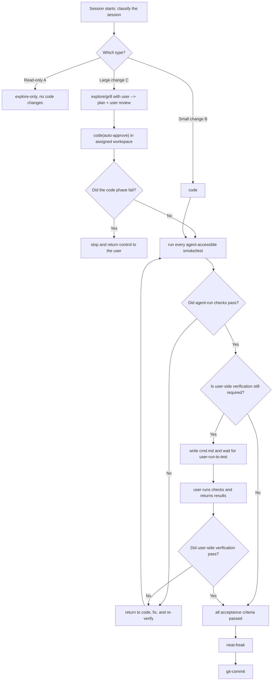

<!-- init-repo-agents:managed:begin -->

# RLinf · Agent Collaboration Guide

> A distributed reinforcement learning stack for embodied, reasoning, and agentic AI.

**Primary toolchain:** Python with uv, Ruff, and ty

This file defines the behavioral baseline for agents working in this repository. The core principle is: **align before acting, and collaborate instead of making unilateral assumptions.** Clear context alignment with the user is a prerequisite for writing code.

---

## 0. Session Lifecycle (Highest-Level Constraint)

**At the start of every session, the agent must explicitly classify and state the session type** before following the corresponding lifecycle. Do not skip this classification.

**The execution environment is an input to the session.** The current branch, worktree, or other isolated environment is selected by the user or external scheduler before the session starts. The lifecycle below describes one session only. It must not decide how many tasks run in parallel or create or switch workspaces on its own. Unless the user explicitly changes the assignment, stay inside the provided workspace.

- **Type A · Read-only exploration** (`explore-only`): answer questions and investigate without changing code. Gather context in read-only mode and do not enter the coding lifecycle.
- **Type B · Small code change** (`small code`): the change is small, intent is clear, and no major trade-off exists. Skip heavyweight grilling and follow `code → verify → neat-freak → git-commit`.
- **Type C · Large code change** (`large code`): the change is large, architectural, or involves meaningful trade-offs. Follow the full lifecycle, remain in the assigned workspace, and pass the verification gate before wrapping up.



**Type C signals:** irreversible or destructive operations, architectural decisions, or work that must be decomposed into multiple subtasks. When uncertain, classify the session as Type C and align before acting.

**Type C failure handling:** the `code` phase may proceed with auto-approval, but repeated failures or uncertainty about intent require an immediate stop. Return control to the user instead of gambling on another change (see Section 3).

---

## 1. Timing · What to Do When

- **At session start:** determine whether this is a new task or a continuation. For a continuation, read `docs/plan.md` and `docs/log.md` first to recover prior progress and reasoning.
- **Before a Type C task starts:** use the grill workflow in Section 2 to align context and ensure the implementation path matches the user's intent.
- **After candidate code is written:** enter the verification gate below. Implementation is complete at this point; the task is not.
- **After verification passes:** run `neat-freak` at task completion or a milestone to reconcile code, documentation (`docs/`, `README.md`), and memory. Do not spend time synchronizing documentation for code that may not work.
- **After each task passes verification:** prepend an entry to `docs/log.md`. Never record an unverified task as complete.

### Verification Gate (Between Code and Wrap-Up)

1. Before coding, use `karpathy-guidelines` to define observable acceptance criteria. After coding, derive the required checks from those criteria rather than relying on "looks correct."
2. Run an appropriate combination of lint, typecheck, unit tests, and smoke tests wherever the agent can access the required environment. Preserve results that can be reviewed.
3. If acceptance depends on a real robot, VLA setup, dedicated hardware, user credentials, or another environment unavailable to the agent, update the pending-verification section in root `cmd.md` with prerequisites, copyable commands, pass criteria, and the evidence to return on failure. Then stop and wait for the user to run it.
4. Any failed required check returns the task to `code`, followed by the full verification gate again. Do not reuse results invalidated by a fix.
5. Only after every required check passes may the agent run `neat-freak`, record completion in `docs/log.md`, and invoke `git-commit`. During verification, update only the `cmd.md` content required for testing; do not begin broad documentation synchronization.

## 2. Alignment · Prerequisite for Coding (Embedded Grill Workflow)

This is the most important rule. **Never hide uncertainty, rely on guesses, or start implementation while the user's intent is unclear.** Before a Type C change, follow Grill → Distill → Execute. Do not execute until the first two phases are complete.

**Grill**
- Follow the decision tree one question at a time and wait for the answer before asking the next.
- Give a recommended answer and a one-sentence reason with every question.
- Investigate anything that can be answered from code or documentation instead of asking the user.
- When terminology is ambiguous or overloaded, propose one canonical term before continuing (for example: "Does `env` mean the Conda environment or the simulation environment? Choose one.").
- Use concrete scenarios to make unclear relationships or boundaries precise.
- Cross-check the user's description of system behavior against the code and surface contradictions immediately.

**Distill**
- Once discussion converges, write only durable outcomes into this file, then stop for user confirmation. Record only:
  - **Glossary:** canonical terms in the form `term — definition`, without implementation details.
  - **Decisions:** difficult-to-reverse choices in the form `choice · alternatives · rationale`.
- Record a decision only when it is difficult to reverse, surprising without context, and the result of a real trade-off. Skip it unless all three conditions hold.

**Execute**
- Only now write the implementation plan and begin work, following the decisions just recorded.

Follow `karpathy-guidelines`: make the smallest surgical change, avoid speculative design, state assumptions explicitly, and define verifiable success criteria.

## 3. Exceptions · Know When to Stop

When the available context is insufficient for a sound decision, **stop and return control to the user** instead of guessing.

Signals that the agent is stuck include repeating the same failed action, uncertainty about the user's actual intent, approaching an irreversible or destructive operation, or making no progress after multiple attempts.

## 4. Collaboration · Finding Context When a Problem Is Not Immediately Solvable

An agent does not inherently know the details of a specific codebase. When a problem cannot be solved directly, find enough relevant context in this order:

1. **Documentation details** → use `ctx7` / `find-docs` for current library, framework, and API documentation, even for familiar technology.
2. **Unusual bugs** → search online and use `gh` (`gh-cli`) to inspect relevant repository issues.
3. **Still unclear** → ask the user for missing context or stop and return the decision to them.

Base decisions on evidence rather than guesses.

## 5. Documentation · `docs/` Is Shared Project Context

Do not rely excessively on Git history. Maintain readable project context in `docs/` so future sessions can resume quickly and the project can move across machines and agents without depending on CLI-specific global memory. Maintain:

- `docs/plan.md` — the forward-looking plan shared by the user and agent.
- `docs/log.md` — verified completed tasks, with the newest entry first.
- `docs/bug.md` — reusable lessons about unusual bugs, including triggers, fixes, and causes.
- `docs/<module>.md` — module-level responsibilities and boundaries, indexed below.

### Code Documentation Index

Fill module documentation **incrementally**. Create `docs/<module>.md` the first time a module is explored deeply; afterward, read the documentation first to avoid repeatedly rediscovering the code.

<!-- init-repo-agents:module-index:begin -->
- [[docs/agents.md]] — agents module (`rlinf/agents/`)
- [[docs/algorithms.md]] — algorithms module (`rlinf/algorithms/`)
- [[docs/data.md]] — data module (`rlinf/data/`)
- [[docs/envs.md]] — envs module (`rlinf/envs/`)
- [[docs/hybrid-engines.md]] — hybrid_engines module (`rlinf/hybrid_engines/`)
- [[docs/models.md]] — models module (`rlinf/models/`)
- [[docs/runners.md]] — runners module (`rlinf/runners/`)
- [[docs/scheduler.md]] — scheduler module (`rlinf/scheduler/`)
- [[docs/utils.md]] — utils module (`rlinf/utils/`)
- [[docs/workers.md]] — workers module (`rlinf/workers/`)
<!-- init-repo-agents:module-index:end -->
<!-- Seeded from a shallow structural scan during initialization, for example:
- [[docs/datasets.md]] — dataset loading and metadata (`src/<pkg>/datasets/`)
- [[docs/policies.md]] — policy models (`src/<pkg>/policies/`)
Keep unwritten entries as placeholders and fill them when the module is explored. -->

## 6. Command Interfaces · Reduce Manual Command Entry

Consolidate common development commands and complex experiment configuration behind reusable interfaces so neither the user nor the agent must repeatedly reconstruct long commands.

### 6.1 `dev.sh` · Unified Project Entry Point

- **`examples/embodiment/run_embodiment.sh` (conventionally `dev.sh`)** wraps common development and launch commands: environment setup, lint, format, typecheck, tests, training, inference, evaluation, and data processing. Expose them as subcommands such as `./dev.sh train`, `./dev.sh eval`, and `./dev.sh lint`.
- When a workflow becomes common, add a `dev.sh` subcommand instead of asking the user to remember a raw command.
- Keep `dev.sh` focused on orchestration: compose commands, load configuration, and pass arguments while implementation remains in the appropriate scripts or entry points.

### 6.2 Complex Parameters · YAML-Driven Experiments

- Put complex experiment parameters in YAML files such as `experiments/<exp_name>.yaml` instead of long command lines. Each experiment file is a complete reproducible configuration.
- Let `dev.sh` options override YAML values, for example: `./dev.sh train --config experiments/foo.yaml --override lr=1e-4`. Baselines remain in YAML while temporary tuning uses options.
- This keeps experiments reproducible, reduces tuning overhead, and lets agents inspect and modify experiment configuration directly.

### 6.3 `cmd.md` · Command Reference

- Root `cmd.md` contains copyable commands for the user, including `dev.sh` examples and typical experiment launches.
- When required verification can only be performed by the user, add or update one pending-verification block. Render it in the user-facing documentation language defined in Section 8 and include these semantic fields:

```markdown
## Pending User Verification
- **Status:** Pending
- **Purpose:** <what this change must prove>
- **Prerequisites:** <required device, environment, data, or service>
- **Commands:** `<copyable commands in execution order>`
- **Pass criteria:** <observable and unambiguous success>
- **Return on failure:** <logs, output, screenshots, or device behavior>
```

- When the user returns results, either mark verification as passed or return to code. Delivering commands is not equivalent to passing verification.

## 7. Code Standards

- **Modern Python projects:** follow `modern-python` conventions, including uv, ruff, and ty.
- **Docstrings:** use Google-style docstrings.
- **Comment granularity:** use one short section comment per coherent block when explanation is useful.
- **Comment intent:** explain why the block exists, not what each statement does. Do not write noise such as `# Import modules`.

## 8. Language Conventions

- **Agent-facing repository instructions:** write `AGENTS.md` and its mirrored `CLAUDE.md` in English.
- **Code comments:** write in English.
- **User-facing documentation:** write `docs/`, `README.md`, and `cmd.md` in Chinese.
- **Agent-only material:** write system prompts, internal plans, and internal notes in English.
<!-- init-repo-agents:managed:end -->

<!-- init-repo-agents:preserved-content-below -->

# AGENTS.md

Brief for AI coding agents working on RLinf. For full contribution flow, code style, and PR process see [CONTRIBUTING.md](CONTRIBUTING.md).

**Quick orientation:** RLinf is a distributed RL stack (embodied + reasoning + agent). It uses **Ray** for process management and **Hydra** for config. Single-machine runs use `cluster.num_nodes: 1`; multi-node needs Ray started on every node with `RLINF_NODE_RANK` set *before* `ray start`. Pre-commit runs Ruff (lint + format) and commit-check; use Google-style docstrings and type hints. All user-facing changes need tests and docs. If something is unclear, add a `TODO(agent)` and note the limitation.

---

## Code structure

- **`.cursor/`** – Rules and skills: `rules/agents-md.mdc`, `skills/add-install-docker-ci-e2e`, `skills/add-example-doc-model-env`, `skills/review-pr`.
- **`rlinf/`** – Main package:
  - `agents/` – Agent logic (reasoning, tools).
  - `algorithms/` – Advantages, losses, registry, rewards (math, code, searchr1, vqa).
  - `config.py` – Hydra config, `SupportedModel`, `SupportedEnvType`, validation.
  - `data/` – Datasets for embodied, reasoning, agent.
  - `envs/` – ManiSkill, LIBERO, IsaacLab, CALVIN, MetaWorld, Behavior, RoboCasa, FrankaSim, RealWorld, RoboTwin, Habitat, OpenSora world model; `get_env_cls()` in `envs/__init__.py`.
  - `hybrid_engines/` – SGLang/vLLM rollout integration.
  - `models/` – Embodiment (OpenVLA, OpenVLA-OFT, OpenPI, GR00T, MLP/CNN/Flow/CMA) and reasoning wiring.
  - `runners/` – Embodied (sync/async), reasoning, coding_online_rl, agent, SFT, eval.
  - `scheduler/` – Cluster, Worker, WorkerGroup, channel, manager, placement, dynamic_scheduler.
  - `utils/` – Logging, placement, data iter, distributed, checkpoint, resharding.
  - `workers/` – Actor (FSDP/Megatron), rollout (HF/server), env (sync/async), reward, replay buffer.
- **`examples/`** – Entrypoints and YAML: embodiment, reasoning, coding_online_rl, searchr1, sft, wideseek_r1.
- **`tests/`** – `unit_tests/`, `e2e_tests/` (embodied, agent, reasoning), scheduler tests; e2e configs under `e2e_tests/embodied/*.yaml`.
- **`requirements/`** – `install.sh` (targets: embodied, reason, docs; `--model`, `--env`), optional deps in subdirs.
- **`docker/`** – Dockerfile and build targets per model/env.
- **`ray_utils/`** – `start_ray.sh` (multi-node head/worker), `check_ray.sh`, `realworld/setup_before_ray.sh`.
- **`toolkits/`** – Checkpoint converters, verifiers, eval scripts, replay buffer, auto-placement.
- **`docs/`** – Sphinx RST (EN/ZH): start, tutorials, examples, APIs, FAQ.

---

## How RLinf runs

You launch one entry script (e.g. `train_embodied_agent.py`, `train_async.py`). It builds a **Cluster** (Ray must already be up), figures **component placement** (actor, rollout, env, reward, agent), and starts **Worker** groups. A **Runner** drives the loop: rollout → reward → advantage → actor update (and any inference/engine lifecycle). Cluster config lives in YAML under `cluster:`: `num_nodes`, `component_placement`, `node_groups` (labels, node_ranks, env_configs, optional hardware e.g. Franka). Placement (e.g. `HybridComponentPlacement`, `ModelParallelComponentPlacement`) maps components to node groups and hardware ranks. Workers are Ray remote actors with `MASTER_*`, `RANK`, etc.; they can `send`/`recv` across groups. Training backends: FSDP or Megatron. Rollout: SGLang or vLLM. Runners pick loss/advantage from config (PPO, GRPO, SAC, etc.).

---

## Single-node and multi-node

**Single machine:** Install via Docker or `bash requirements/install.sh embodied --model <model> --env <env>` (set `REPO_PATH` and any asset paths). Ray may auto-start; or run `ray start --head`. Use a config with `cluster.num_nodes: 1` (e.g. from `examples/embodiment/config/`). Launch with `bash examples/embodiment/run_embodiment.sh <config_name>` or `python examples/embodiment/train_embodied_agent.py --config-name <config_name>`, and set env vars the example needs (e.g. `MUJOCO_GL=egl`, `ROBOT_PLATFORM`).

**Multiple machines:** On each node, *before* `ray start`: set `export RLINF_NODE_RANK=<0..N-1>` (unique) and optionally `RLINF_COMM_NET_DEVICES`. Head: `ray start --head --port=6379 --node-ip-address=<head_ip>`. Workers: `ray start --address=<head_ip>:6379`. You can use `ray_utils/start_ray.sh`. Set `cluster.num_nodes` to the total; optionally use `node_groups` and `component_placement` (see `rlinf/scheduler/cluster/config.py` and the [heterogeneous cluster tutorial](https://rlinf.readthedocs.io/en/latest/rst_source/guides/hetero.html)). Run the entry script *only on the head*; it attaches to the existing Ray cluster and schedules workers by placement.

---

## Configuration guides

- **Placement and throughput:** Configure `cluster.component_placement` (collocated vs disaggregated vs hybrid, node groups, hardware ranks). See [placement tutorial](https://rlinf.readthedocs.io/en/latest/rst_source/concepts/placement.html) and [execution modes](https://rlinf.readthedocs.io/en/latest/rst_source/concepts/execution_modes.html).
- **OOM:** Tune env (`total_num_envs`, `group_size`), rollout (batch/seq, `gpu_memory_utilization`, `enable_offload`), actor (`micro_batch_size`, `global_batch_size`, `gradient_checkpointing`, `enable_offload`). Example configs in `examples/embodiment/config/`. See [FAQ](https://rlinf.readthedocs.io/en/latest/rst_source/resources/faq.html) for SGLang/memory issues.
- **Multi-node and hetero:** Set `cluster.num_nodes`; set `RLINF_NODE_RANK` (and optionally `RLINF_COMM_NET_DEVICES`) **before** `ray start` on each node—Ray captures env at start time. Optional `node_groups` and `component_placement` in YAML; `env_configs` (e.g. `env_vars`, `python_interpreter_path`) are applied at worker allocation. See [heterogeneous cluster](https://rlinf.readthedocs.io/en/latest/rst_source/guides/hetero.html) and `rlinf/scheduler/cluster/config.py`.

---

## Metrics, checkpoints, and evaluation

- **Metrics:** Runners use `MetricLogger`; set `runner.logger.logger_backends` (e.g. tensorboard, wandb, swanlab). Namespaces include `train/`, `eval/`, `env/`, `rollout/`, `time/`. See [logger tutorial](https://rlinf.readthedocs.io/en/latest/rst_source/guides/logger.html).
- **Checkpoints:** Saved every `runner.save_interval` under `.../checkpoints/global_step_<N>/`. To resume, set `runner.resume_dir` to that path and relaunch; some runners support `resume_dir: auto`. See [checkpoint resume tutorial](https://rlinf.readthedocs.io/en/latest/rst_source/guides/resume.html).
- **Evaluation:** During training, `runner.val_check_interval` triggers validation. Standalone embodied: `bash evaluations/run_eval.sh <benchmark> <config_name>` (configs under `evaluations/<benchmark>/`); see [Evaluation](https://rlinf.readthedocs.io/en/latest/rst_source/evaluations/index.html). Reasoning/LLM: see [LLMEvalKit](https://github.com/RLinf/LLMEvalKit).

---

## When things go wrong

For debugging (breakpoints, rendering/EGL, network, NCCL/CUDA, timeouts), see the [FAQ](https://rlinf.readthedocs.io/en/latest/rst_source/resources/faq.html) in Further reading.

---

## Key ideas and plugging in

**Config** (`rlinf/config.py`): `build_config` / `validate_cfg` produce the full DictConfig. New model or env types go into `SupportedModel` / `SupportedEnvType` and validation.

**Cluster and placement:** `ClusterConfig` and strategies in `rlinf/scheduler/placement/`, `rlinf/utils/placement.py`. Placement controls where actor/rollout/env run (one node vs many, GPU vs CPU, heterogeneous).

**Algorithms:** Advantage and loss functions are registered in `rlinf/algorithms/` (registry + decorators); rewards are registered in `rlinf/algorithms/rewards/`. Config keys `algorithm.adv_type` and `algorithm.loss_type` select them. See [Extending RLinf: algorithms, models, envs](#extending-rlinf-algorithms-models-envs) for step-by-step instructions.

**Models (embodied):** Register in `SupportedModel` in `config.py`, implement under `rlinf/models/embodiment/<name>/` (e.g. `BasePolicy`), wire in config and workers. Use add-install-docker-ci-e2e for install/Docker/CI. Details in the extension section below.

**Environments:** Register in `SupportedEnvType` and `get_env_cls()` in `rlinf/envs/__init__.py`, implement under `rlinf/envs/<name>/`. Use add-install-docker-ci-e2e and add-example-doc-model-env for install and docs. Details below.

**Workers:** Subclass `Worker`, implement `initialize` and your API, launch with `create_group(...).launch(...)`. Use `self.log_info` / `log_warning` / `log_error`; no print.

**Runners:** They own the training loop. New task type = new runner + entry script that builds Cluster, placement, worker groups, and calls the runner.

---

## Extending RLinf: algorithms, models, envs

### New algorithms (advantage, loss, reward)

**Advantage function**

- Implement a function that takes the same keyword args as existing ones (e.g. `rewards`, `values`, `dones`, `gamma`, `loss_mask`, …) and returns `(advantages, returns)`. See `rlinf/algorithms/advantages.py` (e.g. `compute_gae_advantages_and_returns`) for signatures.
- Register it: `from rlinf.algorithms.registry import register_advantage` then `@register_advantage("my_adv")` on your function. The name is case-normalized to lowercase.
- In config YAML set `algorithm.adv_type: my_adv`. Actor workers call `calculate_adv_and_returns(adv_type=...)` which dispatches via `get_adv_and_returns(name)`.
- For non-GAE styles (e.g. GRPO, Reinforce++), `rlinf/algorithms/utils.py` may need to compute scores first; check how `adv_type` is used in `calculate_adv_and_returns` and in the actor worker.

**Policy loss**

- Implement a function that accepts the kwargs passed by the actor (e.g. `logprobs`, `old_logprobs`, `advantages`, `clip_ratio_low`, `clip_ratio_high`, `loss_mask`, …) and returns `(loss_tensor, metrics_dict)`. See `rlinf/algorithms/losses.py` (e.g. `compute_ppo_actor_loss`, `compute_ppo_actor_critic_loss`, `compute_grpo_actor_loss_fn`).
- Register: `from rlinf.algorithms.registry import register_policy_loss` then `@register_policy_loss("my_loss")`.
- In config set `algorithm.loss_type: my_loss`. For PPO-style actor+critic you need a critic and value loss; the unified entry is `policy_loss(loss_type=..., **kwargs)` in `registry.py`. Add validation in `rlinf/config.py` if your loss has special requirements (e.g. `validate_cfg` already checks `loss_type == "actor_critic"` for value head).

**Reward**

- Add a reward class (e.g. under `rlinf/algorithms/rewards/<domain>/`) that matches the interface expected by the reward worker (e.g. callable or class with a clear contract for prompt/completions/ids).
- In `rlinf/algorithms/rewards/__init__.py`: import the class, then `register_reward("my_reward", MyRewardClass)`. The registry is `reward_registry`; lookup via `get_reward_class(name)`.
- Wire the reward name in config and in the runner/reward worker so the correct class is instantiated and used. For reasoning/agent tasks the config path may be under `reward.path` or similar.

### New embodied model

- **Registration:** In `rlinf/config.py`, add a new value to the `SupportedModel` enum: `MY_MODEL = ("my_model", "embodied")`. Use `get_supported_model(model_type)` in validation so `model.model_type: my_model` is accepted.
- **Implementation:** Create a package under `rlinf/models/embodiment/my_model/`. For policies that fit the embodied actor interface, inherit from `rlinf.models.embodiment.base_policy.BasePolicy` and implement `default_forward` and `predict_action_batch`; add other forward types (e.g. `sac_forward`, `crossq_forward`) if the algorithm needs them. For HuggingFace-based VLAs, follow the pattern in the docs: register config and processor in `rlinf/models/__init__.py` (`get_model_config_and_processor`), then implement an action model that wraps generation and optional value head.
- **Config and workers:** Ensure `build_config` / default configs provide the right `model.model_type`, checkpoint paths, and any model-specific options. Actor and rollout workers already branch on `cfg.actor.model.model_type` / `cfg.rollout.model.model_type`; add branches or a factory so your model is instantiated and used. For FSDP+HuggingFace, see the [new model (FSDP) tutorial](https://rlinf.readthedocs.io/en/latest/rst_source/extending/new_model_fsdp.html); for Megatron there is a separate [new model (Megatron) tutorial](https://rlinf.readthedocs.io/en/latest/rst_source/extending/new_model_megatron.html).
- **Install and CI:** If the model needs extra deps or a dedicated venv, add it to `requirements/install.sh` (e.g. `SUPPORTED_MODELS`, and an `install_my_model()` or branch in the model switch). For Docker and e2e: use the skill `.cursor/skills/add-install-docker-ci-e2e` (install script, Dockerfile stage, CI job, e2e config under `tests/e2e_tests/embodied/`).

### New environment

- **Registration:** In `rlinf/envs/__init__.py`, add a member to `SupportedEnvType`: e.g. `MY_ENV = "my_env"`. In `get_env_cls(env_type, env_cfg=None, ...)` add an `elif env_type == SupportedEnvType.MY_ENV:` branch that imports your env class and returns it (lazy import to avoid loading heavy deps at import time). If the env needs a task id (like IsaacLab), use `env_cfg` and document the expected shape.
- **Implementation:** Create `rlinf/envs/my_env/` with at least one module defining a gym-style env (e.g. `gymnasium.Env`): `reset`, `step`, and the usual attributes (`observation_space`, `action_space`). Follow the [new environment tutorial](https://rlinf.readthedocs.io/en/latest/rst_source/extending/new_env.html) for the expected structure (e.g. vectorized `num_envs`, `group_size`, `ret_device`). If your env uses custom action formatting, add a branch in `rlinf/envs/action_utils.py` in `prepare_actions(env_type, ...)` so rollout/workers pass correctly shaped actions.
- **Config:** Set `env.train.env_type` and `env.eval.env_type` to the string value of your enum (e.g. `my_env`). Add any env-specific defaults or validation in `rlinf/config.py` (e.g. `validate_cfg` already has env-specific checks for ManiSkill, Behavior, etc.; add similar ones if needed).
- **Install and docs:** For install/Docker/CI, use `.cursor/skills/add-install-docker-ci-e2e` (add env to `SUPPORTED_ENVS`, install logic, e2e config). For example docs and RST, use `.cursor/skills/add-example-doc-model-env`.

---

## Style and contributing

Google Python style; Ruff for lint/format; docstrings and type hints on public APIs. Logging: `rlinf.utils.logging.get_logger()` or Workers’ `self.log_*`. Config YAML: static values only; no computed fields; don’t overwrite user-facing fields in code. Commits: [Conventional Commits](https://www.conventionalcommits.org/), ~72-char subject, imperative; every commit `Signed-off-by:` (e.g. `git commit -s`). PRs: same title format, fill template, link issues; for perf-sensitive changes include test results. New behavior needs tests (unit or e2e); if e2e needs GPUs/hardware, document and skip appropriately in CI. Full details: [CONTRIBUTING.md](CONTRIBUTING.md).

---

## Further reading

- [Docs (EN)](https://rlinf.readthedocs.io/en/latest/) · [中文](https://rlinf.readthedocs.io/zh-cn/latest/)
- [Installation](https://rlinf.readthedocs.io/en/latest/rst_source/start/installation.html) · [VLA quickstart](https://rlinf.readthedocs.io/en/latest/rst_source/start/vla.html)
- [Example gallery](https://rlinf.readthedocs.io/en/latest/rst_source/examples/index.html) · configs in `examples/embodiment/config/`, `examples/reasoning/`, etc.
- Tutorials: [placement / cluster / YAML](https://rlinf.readthedocs.io/en/latest/rst_source/concepts/index.html), [hybrid / disaggregated](https://rlinf.readthedocs.io/en/latest/rst_source/concepts/execution_modes.html), [heterogeneous cluster](https://rlinf.readthedocs.io/en/latest/rst_source/guides/hetero.html), [extend (new env/model)](https://rlinf.readthedocs.io/en/latest/rst_source/extending/overview.html), [RL algorithms](https://rlinf.readthedocs.io/en/latest/rst_source/reference/index.html), [logger (metrics)](https://rlinf.readthedocs.io/en/latest/rst_source/guides/logger.html), [checkpoint resume](https://rlinf.readthedocs.io/en/latest/rst_source/guides/resume.html)
- Evaluation: [Evaluation](https://rlinf.readthedocs.io/en/latest/rst_source/evaluations/index.html) · [LLMEvalKit](https://github.com/RLinf/LLMEvalKit)
- [APIs](https://rlinf.readthedocs.io/en/latest/rst_source/reference/api/index.html) (actor, channel, cluster, placement, worker, env, data, …) · [FAQ](https://rlinf.readthedocs.io/en/latest/rst_source/resources/faq.html)
